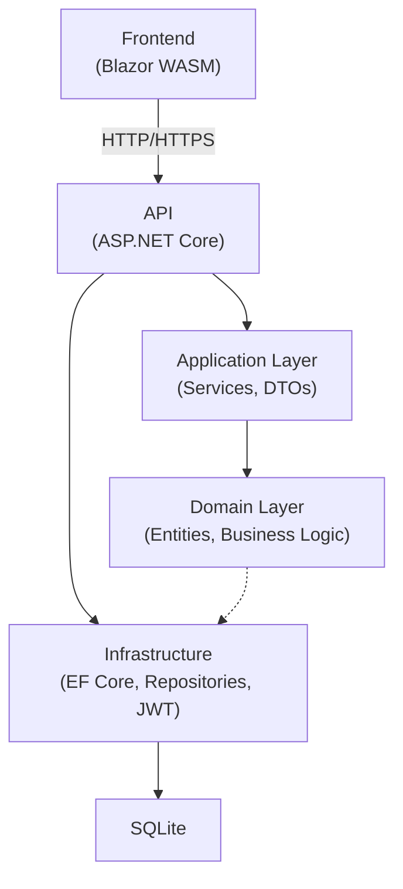

# AdvancedDevSample

[](https://sonarcloud.io/summary/new_code?id=BAYRYO_AdvancedDevSample)
[](https://github.com/BAYRYO/AdvancedDevSample/actions/workflows/quality.yml)
[](https://github.com/BAYRYO/AdvancedDevSample/actions/workflows/security.yml)
[](https://github.com/BAYRYO/AdvancedDevSample/actions/workflows/docs.yml)
[](https://github.com/BAYRYO/AdvancedDevSample/actions/workflows/release.yml)

Construire un logiciel propre, securise et livrable.

`AdvancedDevSample` est un projet de reference full-stack .NET 10 concu pour montrer a quoi ressemble une architecture orientee production dans la pratique :

- frontieres Clean Architecture + DDD qui restent robustes dans le temps
- authentification JWT avec rotation des refresh tokens et limitation du login
- frontend Blazor WebAssembly avec client API type
- EF Core + SQLite avec migrations, seeders et controle de derive du modele
- gates qualite et securite integrees dans GitHub Actions

## Pourquoi ce repo existe

La plupart des exemples sont soit trop simplistes, soit trop lourds pour apprendre vite.
Celui-ci prend un chemin intermediaire :

- assez compact pour etre lu en une journee
- assez strict pour transmettre de bonnes pratiques
- assez complet pour etre lance, teste et livre

## Ce que tu peux apprendre ici

- comment isoler la logique metier des details d'infrastructure
- comment exposer un contrat API exploitable avec des erreurs predictibles
- comment faire tourner une CI avec quality gates, scans securite et deploiement doc
- comment structurer une documentation qui accelere l'onboarding

## Apercu architecture



## Demarrage rapide (5 minutes)

### 1) Prerequis

- .NET SDK 10.x
- Git
- Python 3.11+ (uniquement pour la doc)

### 2) Environnement local

Linux/macOS:

```bash
cp .env.example .env
```

PowerShell:

```powershell
Copy-Item .env.example .env
```

Variables minimales :

- `JWT_SECRET` (obligatoire, >= 32 caracteres)
- `ADMIN_EMAIL` + `ADMIN_PASSWORD` (recommande pour le seeding dev)
- `SENTRY_DSN` (optionnel)

### 3) Lancer l'API + le Frontend

```bash
dotnet restore AdvancedDevSample.slnx
dotnet run --project AdvancedDevSample.Api
dotnet run --project AdvancedDevSample.Frontend
```

URLs de developpement :

- API HTTP: `http://localhost:5069`
- API HTTPS: `https://localhost:7119`
- Frontend HTTP: `http://localhost:5173`
- Frontend HTTPS: `https://localhost:7173`
- Swagger: `http://localhost:5069/swagger`
- Scalar: `http://localhost:5069/scalar/v1`

## Qualite par defaut

Lancer les tests :

```bash
dotnet test AdvancedDevSample.slnx
```

Lancer la couverture :

```bash
dotnet test AdvancedDevSample.slnx --collect:"XPlat Code Coverage"
```

Lancer le pipeline qualite local :

```bash
./eng/quality/quality.sh
```

Equivalent PowerShell :

```powershell
pwsh ./eng/quality/quality.ps1
```

## Documentation

- Version publiee : `https://bayryo.github.io/AdvancedDevSample/`
- Accueil local : `docs/index.md`

Lancer la doc en local :

```bash
python3 -m pip install -r docs/requirements.txt
python3 -m mkdocs serve
```

Puis ouvrir `http://127.0.0.1:8000`.

## Carte du repo

```text
AdvancedDevSample/
├── AdvancedDevSample.Api/             # API ASP.NET Core
├── AdvancedDevSample.Application/     # Cas d'usage, DTOs, interfaces applicatives
├── AdvancedDevSampleDomain/           # Entites, value objects, contrats domaine
├── AdvancedDevSample.Infrastructure/  # EF Core, repositories, persistence, seeders
├── AdvancedDevSample.Frontend/        # Application Blazor WebAssembly
├── AdvancedDevSample.Test/            # Tests unitaires, integration, frontend
├── docs/                              # Contenu MkDocs
└── eng/quality/                       # Scripts qualite locale
```

## Workflows CI

- `quality.yml`: build, tests, seuils couverture, formatage, controle derive EF, gate SonarQube
- `security.yml`: dependency review, CodeQL, Gitleaks
- `release.yml`: publication des artefacts sur tags `v*`
- `docs.yml`: build MkDocs strict + deploiement GitHub Pages

## Commencer selon ton profil

- Nouveau contributeur : `docs/getting-started.md` -> `docs/configuration.md` -> `docs/troubleshooting.md`
- Dev backend : `docs/architecture.md` -> `docs/api.md` -> `docs/database.md`
- Dev frontend : `docs/frontend.md` -> `docs/api.md` -> `docs/security.md`
- Mainteneur : `docs/quality.md` -> `docs/cicd.md` -> `docs/operations.md`

## Licence

Projet a finalite pedagogique. Choisis et ajoute la licence adaptee a ton usage.
