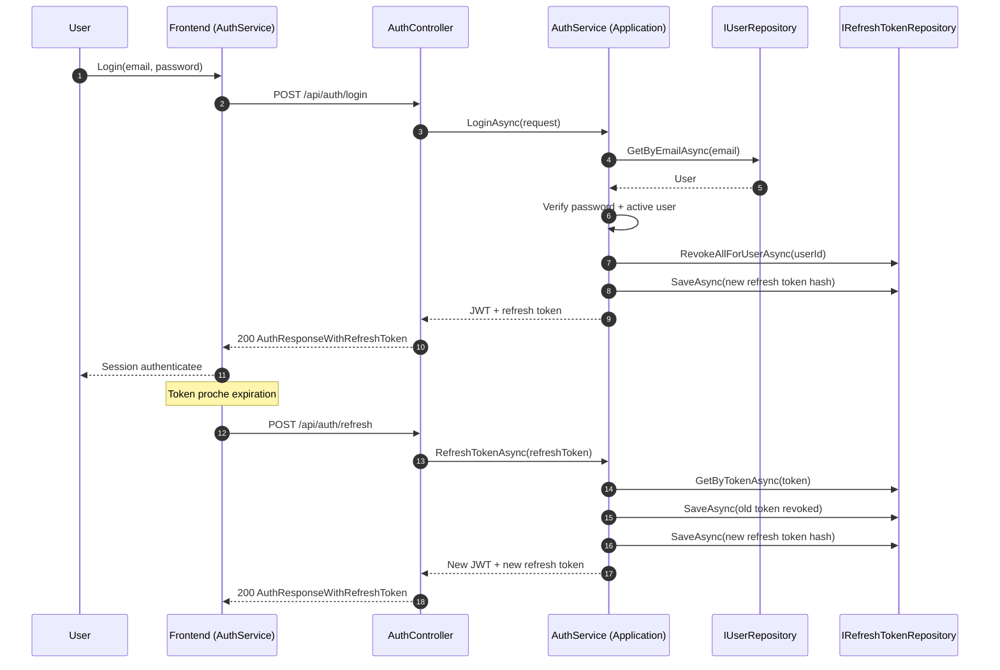

# API

Base URL locale:

- HTTP: `http://localhost:5069`
- HTTPS: `https://localhost:7119`

## Conventions

- format JSON
- IDs en `Guid`
- erreurs middleware en JSON
- auth via `Authorization: Bearer <token>`

## Authentification et autorisation

- JWT valide issuer/audience/signature/expiration
- politiques:
  - `AdminOnly` => role `Admin`
  - `UserOrAdmin` => role `User` ou `Admin` (definie, peu utilisee pour l'instant)

## Endpoints d'authentification

### Sequence cle: login + refresh token



### `POST /api/auth/register`

Cree un utilisateur, renvoie JWT + refresh token.

Request:

```json
{
  "email": "user@example.com",
  "password": "StrongPassword!123",
  "firstName": "Jane",
  "lastName": "Doe"
}
```

Reponse `201`:

```json
{
  "token": "<jwt>",
  "expiresAt": "2026-02-09T13:00:00Z",
  "refreshToken": "<refresh-token>",
  "refreshTokenExpiresAt": "2026-02-16T13:00:00Z",
  "user": {
    "id": "...",
    "email": "user@example.com",
    "firstName": "Jane",
    "lastName": "Doe",
    "fullName": "Jane Doe",
    "role": "User",
    "isActive": true,
    "createdAt": "...",
    "lastLoginAt": null
  }
}
```

### `POST /api/auth/login`

- limite de debit: **5 requetes/minute par IP**
- echec: `401`
- depassement: `429`

Request:

```json
{
  "email": "admin@example.com",
  "password": "StrongPassword!123"
}
```

### `POST /api/auth/refresh`

Request:

```json
{
  "refreshToken": "<refresh-token>"
}
```

- invalide/expire/revoque => `401`

### `GET /api/auth/me`

- necessite JWT valide
- renvoie l'utilisateur courant

## Endpoints produits (`/api/products`)

| Methode | Route | Auth | Description |
| --- | --- | --- | --- |
| `POST` | `/api/products` | JWT | Creer un produit |
| `GET` | `/api/products` | Public | Recherche paginee |
| `GET` | `/api/products/{id}` | Public | Obtenir un produit |
| `PUT` | `/api/products/{id}` | JWT | Mettre a jour |
| `DELETE` | `/api/products/{id}` | Admin | Supprimer |
| `PUT` | `/api/products/{id}/price` | JWT | Changer le prix |
| `POST` | `/api/products/{id}/discount` | JWT | Appliquer remise |
| `DELETE` | `/api/products/{id}/discount` | JWT | Supprimer remise |
| `GET` | `/api/products/{id}/price-history` | Public | Historique prix |
| `POST` | `/api/products/{id}/activate` | JWT | Activer |
| `POST` | `/api/products/{id}/deactivate` | JWT | Desactiver |

### Recherche produits

`GET /api/products?name=...&minPrice=...&maxPrice=...&categoryId=...&isActive=...&page=1&pageSize=20`

Contraintes:

- `page >= 1`
- `pageSize` entre `1` et `100`

## Endpoints categories (`/api/categories`)

| Methode | Route | Auth | Description |
| --- | --- | --- | --- |
| `POST` | `/api/categories` | JWT | Creer une categorie |
| `GET` | `/api/categories` | Public | Lister categories |
| `GET` | `/api/categories/{id}` | Public | Detail categorie |
| `PUT` | `/api/categories/{id}` | JWT | Mettre a jour |
| `DELETE` | `/api/categories/{id}` | Admin | Supprimer |

Filtre disponible:

- `GET /api/categories?activeOnly=true`

## Endpoints utilisateurs (`/api/users`) - Admin uniquement

| Methode | Route | Description |
| --- | --- | --- |
| `GET` | `/api/users?page=1&pageSize=20` | Liste paginee |
| `GET` | `/api/users/{id}` | Detail utilisateur |
| `PUT` | `/api/users/{id}/role` | Changer role (`User`/`Admin`) |
| `DELETE` | `/api/users/{id}` | Desactivation (soft delete) |

## Statuts HTTP par endpoint (resume)

### Auth

| Endpoint | `200` | `201` | `400` | `401` | `409` | `429` |
| --- | --- | --- | --- | --- | --- | --- |
| `POST /api/auth/register` |  | Oui | Oui |  | Oui |  |
| `POST /api/auth/login` | Oui |  |  | Oui |  | Oui |
| `POST /api/auth/refresh` | Oui |  |  | Oui |  |  |
| `GET /api/auth/me` | Oui |  |  | Oui |  |  |

### Produits

| Endpoint | `200` | `201` | `204` | `400` | `401` | `403` | `404` |
| --- | --- | --- | --- | --- | --- | --- | --- |
| `POST /api/products` |  | Oui |  | Oui | Oui |  |  |
| `GET /api/products` | Oui |  |  |  |  |  |  |
| `GET /api/products/{id}` | Oui |  |  |  |  |  | Oui |
| `PUT /api/products/{id}` | Oui |  |  | Oui | Oui |  | Oui |
| `DELETE /api/products/{id}` |  |  | Oui |  | Oui | Oui | Oui |
| `PUT /api/products/{id}/price` |  |  | Oui | Oui | Oui |  | Oui |
| `POST /api/products/{id}/discount` | Oui |  |  | Oui | Oui |  | Oui |
| `DELETE /api/products/{id}/discount` | Oui |  |  |  | Oui |  | Oui |
| `GET /api/products/{id}/price-history` | Oui |  |  |  |  |  | Oui |
| `POST /api/products/{id}/activate` | Oui |  |  |  | Oui |  | Oui |
| `POST /api/products/{id}/deactivate` | Oui |  |  |  | Oui |  | Oui |

### Categories

| Endpoint | `200` | `201` | `204` | `400` | `401` | `403` | `404` |
| --- | --- | --- | --- | --- | --- | --- | --- |
| `POST /api/categories` |  | Oui |  | Oui | Oui |  |  |
| `GET /api/categories` | Oui |  |  |  |  |  |  |
| `GET /api/categories/{id}` | Oui |  |  |  |  |  | Oui |
| `PUT /api/categories/{id}` | Oui |  |  | Oui | Oui |  | Oui |
| `DELETE /api/categories/{id}` |  |  | Oui |  | Oui | Oui | Oui |

### Utilisateurs (admin)

| Endpoint | `200` | `400` | `401` | `403` | `404` |
| --- | --- | --- | --- | --- | --- |
| `GET /api/users?page=1&pageSize=20` | Oui |  | Oui | Oui |  |
| `GET /api/users/{id}` | Oui |  | Oui | Oui | Oui |
| `PUT /api/users/{id}/role` | Oui | Oui | Oui | Oui | Oui |
| `DELETE /api/users/{id}` | Oui |  | Oui | Oui | Oui |

## DTOs principaux

- produit creation: `name`, `sku`, `price`, `stock`, `description`, `categoryId`
- produit update: tous champs optionnels + `clearCategory`
- categorie creation/update: `name`, `description`, `isActive`
- role utilisateur: `role` regex `User|Admin`

## Reponses d'erreur

Exemple metier (`400`, `404`, `409`):

```json
{
  "title": "Erreur metier",
  "detail": "Le nom du produit est obligatoire."
}
```

Exemple technique (`500`):

```json
{
  "error": "Erreur technique"
}
```

## Exemple de reponse paginee

Exemple `GET /api/products?page=1&pageSize=20`:

```json
{
  "items": [
    {
      "id": "f3f4f4e2-2f76-4f45-ae56-8fd657f2af5e",
      "name": "Keyboard",
      "sku": "KEYBOARD-001",
      "price": 99.99,
      "stock": 25,
      "isActive": true
    }
  ],
  "page": 1,
  "pageSize": 20,
  "totalItems": 1,
  "totalPages": 1
}
```

## Exploration interactive

En environnement `Development`:

- Swagger UI: `/swagger`
- Scalar: `/scalar/v1`

## Voir aussi

- [Securite](security.md)
- [Frontend](frontend.md)
- [Troubleshooting](troubleshooting.md)
