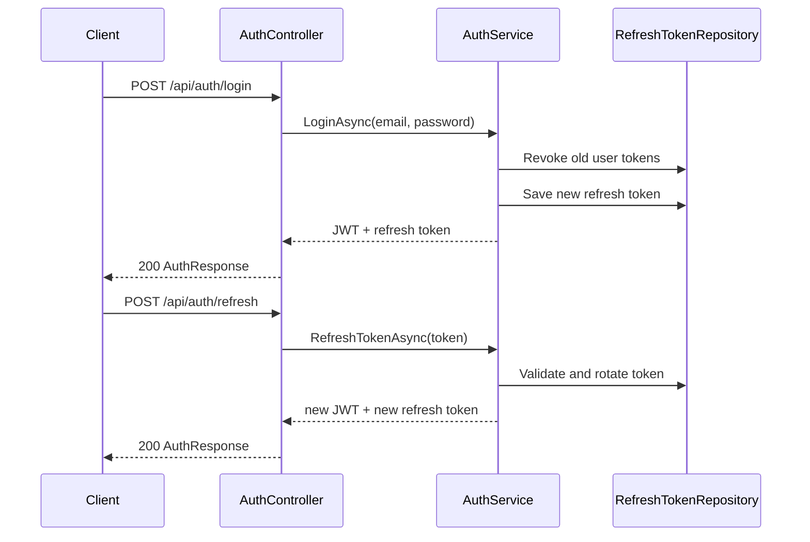
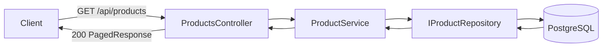

# API

Base URL locale:

- HTTP: `http://localhost:5069`
- HTTPS: `https://localhost:7119`

## Conventions

- format JSON
- identifiants en `Guid`
- auth via `Authorization: Bearer <token>`
- erreurs metier/app: `{ "title": "...", "detail": "..." }`
- erreurs techniques: `{ "error": "Erreur technique" }`

## Authentification et autorisation

- JWT bearer avec validation issuer/audience/signature/expiration
- policies disponibles:
  - `AdminOnly`
  - `UserOrAdmin`

### Sequence login + refresh token



## Routes auth (`/api/auth`)

| Methode | Route | Auth | Notes |
| --- | --- | --- | --- |
| `POST` | `/api/auth/register` | Public | `201`, retourne JWT + refresh token |
| `POST` | `/api/auth/login` | Public | rate limit `5/min/IP` |
| `POST` | `/api/auth/refresh` | Public | rotation refresh token |
| `GET` | `/api/auth/me` | JWT | utilisateur courant |

Exemple login:

```json
{
  "email": "admin@example.com",
  "password": "StrongPassword!123"
}
```

## Routes produits (`/api/products`)

| Methode | Route | Auth | Description |
| --- | --- | --- | --- |
| `POST` | `/api/products` | JWT | creer |
| `GET` | `/api/products` | Public | recherche paginee |
| `GET` | `/api/products/{id}` | Public | detail |
| `PUT` | `/api/products/{id}` | JWT | mise a jour |
| `DELETE` | `/api/products/{id}` | Admin | suppression |
| `PUT` | `/api/products/{id}/price` | JWT | changement de prix |
| `POST` | `/api/products/{id}/discount` | JWT | appliquer remise |
| `DELETE` | `/api/products/{id}/discount` | JWT | supprimer remise |
| `GET` | `/api/products/{id}/price-history` | Public | historique prix |
| `POST` | `/api/products/{id}/activate` | JWT | activation |
| `POST` | `/api/products/{id}/deactivate` | JWT | desactivation |

Recherche:

`GET /api/products?name=&minPrice=&maxPrice=&categoryId=&isActive=&page=1&pageSize=20`

Contraintes:

- `page >= 1`
- `1 <= pageSize <= 100`

### Flux lecture liste produits



## Routes categories (`/api/categories`)

| Methode | Route | Auth | Description |
| --- | --- | --- | --- |
| `POST` | `/api/categories` | JWT | creer |
| `GET` | `/api/categories` | Public | liste |
| `GET` | `/api/categories/{id}` | Public | detail |
| `PUT` | `/api/categories/{id}` | JWT | mise a jour |
| `DELETE` | `/api/categories/{id}` | Admin | suppression |

Filtre supporte:

- `GET /api/categories?activeOnly=true`

## Routes utilisateurs (`/api/users`)

Toutes ces routes requierent la politique `AdminOnly`.

| Methode | Route | Description |
| --- | --- | --- |
| `GET` | `/api/users?page=1&pageSize=20` | liste paginee |
| `GET` | `/api/users/{id}` | detail |
| `PUT` | `/api/users/{id}/role` | role `User` ou `Admin` |
| `DELETE` | `/api/users/{id}` | desactivation (soft delete) |

## Sante et metriques

| Methode | Route | Description |
| --- | --- | --- |
| `GET` | `/health/live` | liveness process |
| `GET` | `/health/ready` | readiness avec test DB |
| `GET` | `/metrics` | route Prometheus |

## Documentation interactive

En `Development`:

- Swagger: `/swagger`
- Scalar: `/scalar/v1`
