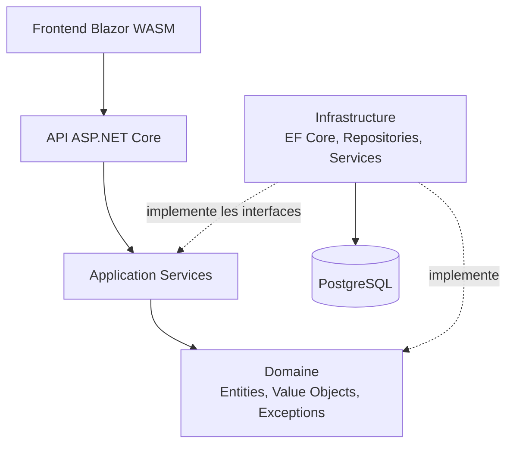

# Architecture

Le projet suit une architecture en couches avec dependances dirigees vers le domaine.

## Vue d'ensemble

## Projets

- `AdvancedDevSample.Api`: composition racine, auth, middlewares, controllers, sante, metriques
- `AdvancedDevSample.Application`: services d'orchestration, DTOs, validation mot de passe
- `AdvancedDevSampleDomain`: modeles metier, value objects, exceptions, interfaces repository
- `AdvancedDevSample.Infrastructure`: EF Core, repositories, mapping, JWT, password hashing, seeders
- `AdvancedDevSample.Frontend`: pages Blazor, services auth/API, gestion de session
- `AdvancedDevSample.Test`: tests domaine, application, integration API/persistence, frontend

## Pipeline HTTP API

Ordre principal:

1. `UseSentryTracing`
2. `UseSwagger` + Scalar (`Development`)
3. `UseHttpsRedirection`
4. `UseCors("Frontend")`
5. `ExceptionHandlingMiddleware`
6. `SecurityHeadersMiddleware`
7. `UseAuthentication`
8. `UseAuthorization`
9. `UseRateLimiter`
10. `MapPrometheusScrapingEndpoint("/metrics")`
11. `MapHealthChecks("/health/live", "/health/ready")`
12. `MapControllers`

## Flux metier typiques

### Creation produit

1. `POST /api/products`
2. `ProductsController` -> `ProductService.CreateAsync`
3. verification metier (SKU, categorie, prix)
4. sauvegarde via `IProductRepository`
5. reponse `201` avec `ProductResponse`

### Login + refresh

1. `POST /api/auth/login`
2. verification credentials + utilisateur actif
3. generation JWT + refresh token
4. revocation des anciens refresh tokens utilisateur
5. `POST /api/auth/refresh` effectue une rotation de refresh token

## Gestion des erreurs

`ExceptionHandlingMiddleware` mappe les exceptions vers des statuts HTTP coherents:

- `DomainException` -> `400`
- `InvalidCredentialsException` -> `401`
- `UserAlreadyExistsException` -> `409`
- `ApplicationServiceException` -> statut porte par l'exception
- `InfrastructureException` -> `500`
- exception inattendue -> `500`
