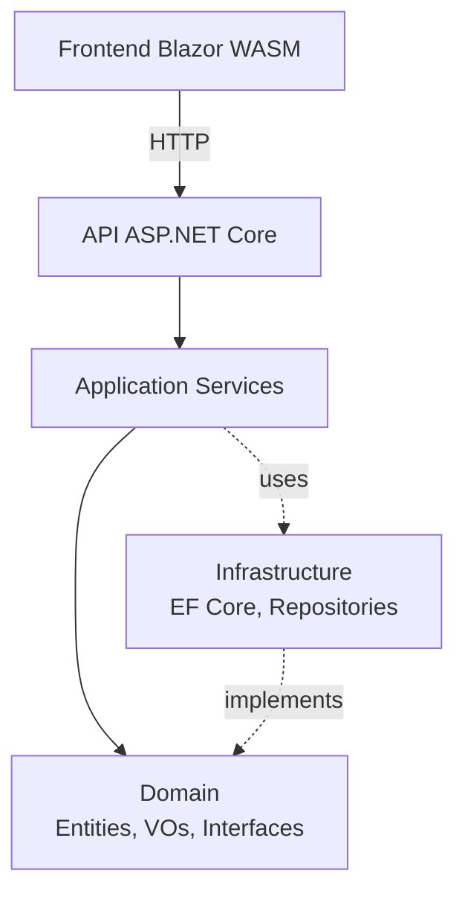

# Architecture

Le projet suit une architecture en couches avec dependances orientees vers le coeur metier.

## Vue d'ensemble

## Projets et responsabilites

- `AdvancedDevSample.Api`
  - configuration DI
  - middleware (exceptions, security headers)
  - authentication/authorization/rate limiting
  - controllers HTTP

- `AdvancedDevSample.Application`
  - orchestration de cas d'usage
  - DTOs d'entree/sortie
  - validations applicatives (ex: robustesse mot de passe)
  - interfaces transverses (`IJwtService`, `IPasswordHasher`, `ITransactionManager`)

- `AdvancedDevSampleDomain`
  - entites metier (`Product`, `Category`, `User`, `RefreshToken`, `AuditLog`)
  - value objects (`Sku`, `Stock`, `Price`, `Discount`)
  - exceptions metier
  - contrats repositories

- `AdvancedDevSample.Infrastructure`
  - `AppDbContext` EF Core
  - mapping domaine <-> persistence
  - repositories EF
  - service JWT + hash password
  - seeders de donnees

- `AdvancedDevSample.Frontend`
  - pages UI Blazor
  - client API typed
  - etat d'authentification navigateur

- `AdvancedDevSample.Test`
  - tests domaine/application
  - tests integration API/middlewares
  - tests frontend

## Flux type: creation de produit

1. `POST /api/products` recu par `ProductsController`
2. `ProductService.CreateAsync()` valide SKU et categorie
3. creation de l'entite `Product`
4. sauvegarde via `IProductRepository` (implementation EF)
5. retour d'un `ProductResponse`

## Flux type: login + refresh token

1. `POST /api/auth/login`
2. `AuthService` valide credentials et etat actif utilisateur
3. generation JWT (`IJwtService`) + refresh token stocke en hash
4. frontend stocke session (token + refresh token)
5. expiration proche => appel `POST /api/auth/refresh`
6. ancien refresh token revoque, nouveau token emis

## Transactions

- les operations multi-etapes sensibles (prix, discount, updates complexes) utilisent `ITransactionManager`
- implementation `EfTransactionManager` en infrastructure

## Strategie d'erreurs

- exceptions domaine/app/infrastructure capturees par `ExceptionHandlingMiddleware`
- mapping vers statuts HTTP coherents (`400/401/404/409/500`)
- format JSON standardise:
  - metier: `{ "title": "...", "detail": "..." }`
  - technique: `{ "error": "Erreur technique" }`

## Decouplage et testabilite

- les services d'application dependent d'interfaces
- l'API ne depend pas des details EF
- tests integration incluent des repositories memoire et SQLite selon scenario
