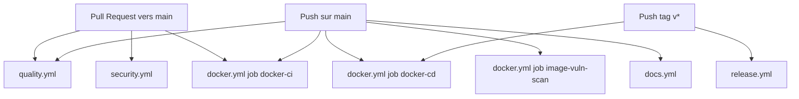
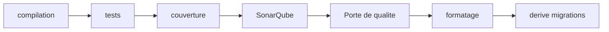

# CI/CD

Le repository utilise GitHub Actions pour la qualite, la securite, Docker, les versions et la documentation.

## Vue pipeline

## `quality.yml`

Declencheurs:

- `workflow_dispatch`
- push `main`
- pull request vers `main`

Notes de declenchement:

- workflow filtre par chemins applicatifs/tests/quality/workflow
- un changement hors chemins filtres ne declenche pas `quality.yml`

Actions:

1. restauration + compilation + tests + couverture
2. seuils couverture
3. SonarQube + attente de la porte de qualite
4. verification formatage
5. verification derive migrations EF

## `security.yml`

Declencheurs:

- pull request `main`
- cron hebdomadaire (lundi 03:00 UTC)

Actions:

- revue des dependances (PR)
- CodeQL C#
- scan secrets Gitleaks

## `docker.yml`

Declencheurs:

- pull request `main` (sur chemins applicatifs/docker)
- push `main`
- push tags `v*`

Notes de declenchement:

- workflow filtre par chemins (sources applicatives, Dockerfiles, compose, build props/targets)
- sur `push`, publication d'images active (jobs `docker-cd` puis `image-vuln-scan`)

Jobs:

- `docker-ci`
  - compilation des images API et Frontend
  - `docker compose up -d --build`
  - tests de fumee (`/health/ready` API + disponibilite frontend)
- `docker-cd` (sur push `main` ou tags `v*`)
  - login GHCR
  - buildx multi-architecture (`linux/amd64`, `linux/arm64`)
  - generation SBOM + provenance
  - signature Cosign keyless des images API + Frontend
  - push images API + Frontend
- `image-vuln-scan` (sur push)
  - scan Trivy sur les images publiees
  - blocage sur vulnerabilites `HIGH`/`CRITICAL`

## `release.yml`

Declencheur:

- push tag `v*`

Actions:

1. compilation + tests
2. `dotnet publish` API + Frontend
3. packaging `.tar.gz`
4. creation d une version GitHub avec artefacts

## `docs.yml`

Declencheurs:

- push `main` sur changements docs
- execution manuelle

Notes de declenchement:

- filtre `paths`: `docs/**`, `mkdocs.yml`, `.github/workflows/docs.yml`

Actions:

1. install Python 3.12
2. install dependances docs
3. `mkdocs build --strict`
4. upload + deploy GitHub Pages

## Dependabot

Fichier: `.github/dependabot.yml`

- `nuget`: weekly
- `github-actions`: weekly
