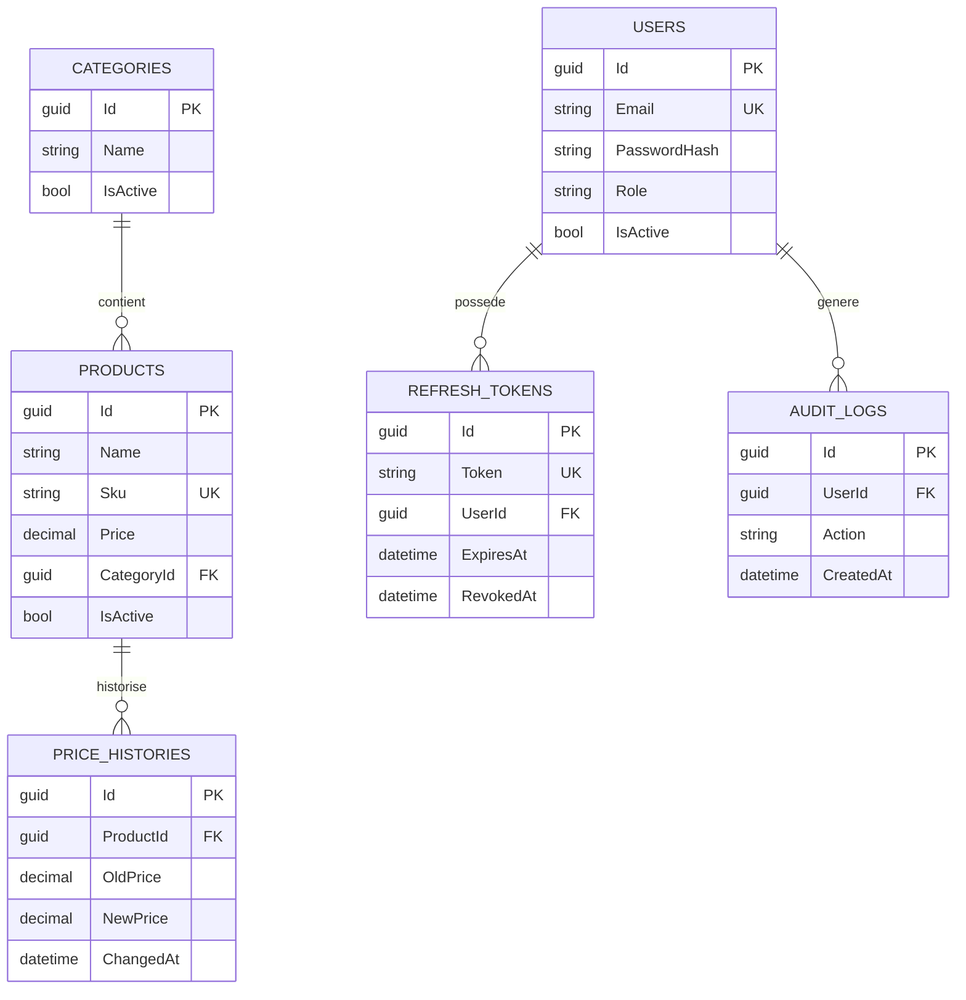
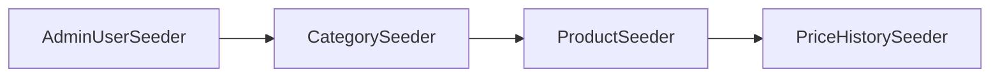

# Base de donnees

Persistance via EF Core 10 + PostgreSQL.

## Contexte EF

- `AppDbContext`: `AdvancedDevSample.Infrastructure/Persistence/AppDbContext.cs`
- provider principal: `UseNpgsql(...)`
- repli possible: base in-memory (`UseInMemoryDatabase`)

## Tables principales

- `Products`
- `Categories`
- `PriceHistories`
- `Users`
- `RefreshTokens`
- `AuditLogs`

## Schema relationnel simplifie



## Contraintes

- `Products.Sku` unique (si non null)
- `Users.Email` unique
- `RefreshTokens.Token` unique (stocke la version hashee du refresh token)
- precision prix `18,2`
- precision remise `5,2`

## Relations

- `Product -> Category` (`SetNull`)
- `PriceHistory -> Product` (`Cascade`)
- `RefreshToken -> User` (`Cascade`)
- `AuditLog -> User` (FK nullable selon type d'evenement)

## Migrations

Dossier:

- `AdvancedDevSample.Infrastructure/Persistence/Migrations`

Comportement au demarrage:

- `UseMigrations=true` + migrations presentes -> `Migrate()`
- sans migration en `Development` -> `EnsureCreated()`
- sans migration hors `Development` -> erreur de demarrage

```mermaid
flowchart TD
  BOOT[Demarrage API] --> CHECK{Migrations presentes?}
  CHECK -->|Oui et UseMigrations=true| APPLY[Migrate()]
  CHECK -->|Non| ENV{Environnement Development?}
  ENV -->|Oui| CREATE[EnsureCreated()]
  ENV -->|Non| FAIL[Arret: migration manquante]
```

## Seeding (`Development`)

Ordre:

1. `AdminUserSeeder`
2. `CategorySeeder`
3. `ProductSeeder`
4. `PriceHistorySeeder`



Details:

- admin cree seulement si aucun admin n'existe
- admin cree seulement si `ADMIN_EMAIL` et `ADMIN_PASSWORD` sont definis
- categories predefinies + categories aleatoires
- produits predefinis + 20 produits aleatoires
- historiques de prix aleatoires par produit

## Verification derive modele

```bash
dotnet ef migrations has-pending-model-changes \
  --project AdvancedDevSample.Infrastructure/AdvancedDevSample.Infrastructure.csproj \
  --startup-project AdvancedDevSample.Api/AdvancedDevSample.Api.csproj \
  --context AppDbContext
```
