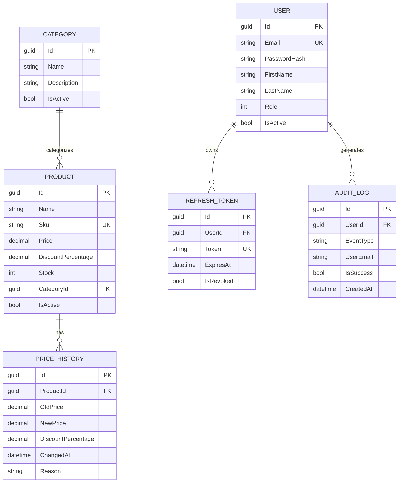

# Base de donnees

Persistance via EF Core 10 + SQLite.

## Contexte

- `AppDbContext`: `AdvancedDevSample.Infrastructure/Persistence/AppDbContext.cs`
- provider: `UseSqlite(...)`
- fallback connection string: `Data Source=advanceddevsample.db`

## Entites persistantes

- `Products`
- `Categories`
- `PriceHistories`
- `Users`
- `RefreshTokens`
- `AuditLogs`

## Contraintes principales

- `Products.Sku` unique (si non null)
- `Users.Email` unique
- `RefreshTokens.Token` unique
- precision prix:
  - `Price` et `OldPrice`/`NewPrice`: `18,2`
  - `DiscountPercentage`: `5,2`

## Relations

- `Product -> Category` (`SetNull` au delete categorie)
- `PriceHistory -> Product` (`Cascade`)
- `RefreshToken -> User` (`Cascade`)

## ERD simplifie



## Migrations

Dossier:

- `AdvancedDevSample.Infrastructure/Persistence/Migrations`

Au demarrage:

- si `UseMigrations=true` et migrations presentes -> `Migrate()`
- si `Development` sans migration -> fallback `EnsureCreated()`
- hors `Development` sans migration -> erreur

## Seeding (dev)

Ordre des seeders:

1. `AdminUserSeeder`
2. `CategorySeeder`
3. `ProductSeeder`
4. `PriceHistorySeeder`

### Admin seeding

- cree un admin uniquement si aucun admin n'existe deja
- requiert `ADMIN_EMAIL` et `ADMIN_PASSWORD`

### Donnees seed

- categories predefinies + categories aleatoires
- produits predefinis + produits aleatoires
- historiques de prix aleatoires

## Verifier la derive de modele

```bash
dotnet ef migrations has-pending-model-changes \
  --project AdvancedDevSample.Infrastructure/AdvancedDevSample.Infrastructure.csproj \
  --startup-project AdvancedDevSample.Api/AdvancedDevSample.Api.csproj \
  --context AppDbContext
```
