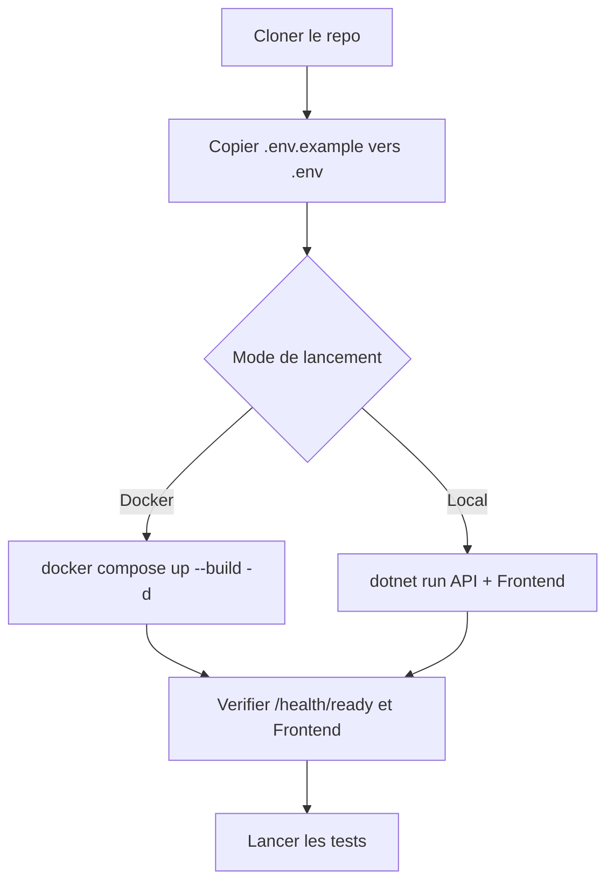

# Demarrage

## Prerequis

- .NET SDK 10.x
- Docker + Docker Compose (recommande)
- Git
- Python 3.11+ (uniquement pour la doc)

## Parcours de demarrage



Verification rapide:

```bash
dotnet --version
docker --version
git --version
python --version
```

## Installation

```bash
git clone <url-du-repo>
cd AdvancedDevSample
dotnet restore AdvancedDevSample.slnx
```

## Configuration minimale

Linux/macOS:

```bash
cp .env.example .env
```

PowerShell:

```powershell
Copy-Item .env.example .env
```

Variables importantes:

- `JWT_SECRET` (obligatoire, >= 32 caracteres)
- `ADMIN_EMAIL` + `ADMIN_PASSWORD` (admin seed en Development)
- `OTEL_EXPORTER_OTLP_ENDPOINT` (optionnel)
- `SENTRY_DSN` (optionnel)

## Lancer avec Docker

```bash
docker compose up --build -d
```

URLs:

- API: `http://localhost:5069`
- Frontend: `http://localhost:8080`
- Swagger: `http://localhost:5069/swagger`
- Scalar: `http://localhost:5069/scalar/v1`
- PostgreSQL: `localhost:5432`

Monitoring local:

```bash
docker compose --profile monitoring up -d
```

- Prometheus: `http://localhost:9090`
- Grafana: `http://localhost:3000`

## Lancer sans Docker

Dans deux terminaux:

```bash
dotnet run --project AdvancedDevSample.Api
```

```bash
dotnet run --project AdvancedDevSample.Frontend
```

URLs de dev:

- API HTTP: `http://localhost:5069`
- API HTTPS: `https://localhost:7119`
- Frontend HTTP: `http://localhost:5173`
- Frontend HTTPS: `https://localhost:7173`

## Premier demarrage API

Au demarrage de l API:

- migrations appliquees si `UseMigrations=true` et migrations presentes
- repli `EnsureCreated()` en `Development` sans migration
- seeding execute uniquement en `Development` si `SeedDatabase=true`

```mermaid
flowchart LR
  START[Demarrage API] --> MIG{UseMigrations=true et migrations presentes?}
  MIG -->|Oui| M[Migrate()]
  MIG -->|Non| DEV{Environnement Development?}
  DEV -->|Oui| EC[EnsureCreated()]
  DEV -->|Non| ERR[Erreur de demarrage]
  M --> SEED{SeedDatabase=true et Development?}
  EC --> SEED
  SEED -->|Oui| RUN[Execution des initialiseurs]
  SEED -->|Non| READY[API prete]
  RUN --> READY
```

## Tests

```bash
dotnet test AdvancedDevSample.slnx
```

Avec couverture:

```bash
dotnet test AdvancedDevSample.slnx --collect:"XPlat Code Coverage"
```

## Documentation locale

```bash
python3 -m pip install -r docs/requirements.txt
python3 -m mkdocs serve
```

Ouvrir `http://127.0.0.1:8000`.
