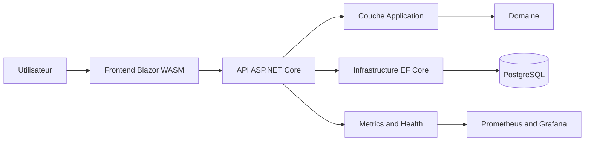

# AdvancedDevSample

Bienvenue dans la documentation technique de `AdvancedDevSample`.

## Objectif

Fournir une base moderne .NET 10 orientee production avec:

- architecture en couches testable
- API REST securisee (JWT + refresh token)
- frontend Blazor WebAssembly
- persistance EF Core + PostgreSQL
- observabilite (checks de sante, metriques Prometheus, Sentry)
- CI/CD complete (qualite, securite, docker, release, docs)

## Vue rapide

## Stack

- .NET 10
- ASP.NET Core
- Blazor WebAssembly
- EF Core 10 + PostgreSQL
- OpenTelemetry + Prometheus + Grafana
- Sentry
- xUnit
- MkDocs Material

## Ce que couvre la documentation

- installation et execution locale
- configuration complete (env, appsettings, CORS, JWT)
- architecture et flux applicatifs
- contrat API (auth, produits, categories, utilisateurs)
- persistance, migrations, seeding
- securite (headers, authz, rate limiting)
- qualite, CI/CD, exploitation, troubleshooting

## Lecture recommandee

1. [Demarrage](getting-started.md)
2. [Configuration](configuration.md)
3. [Architecture](architecture.md)
4. [API](api.md)
5. [Exploitation](operations.md)

## Parcours par profil

- nouveau developpeur: [Demarrage](getting-started.md) -> [Configuration](configuration.md) -> [Depannage](troubleshooting.md)
- developpeur backend: [Architecture](architecture.md) -> [API](api.md) -> [Base de donnees](database.md)
- developpeur frontend: [Frontend](frontend.md) -> [API](api.md) -> [Securite](security.md)
- mainteneur: [Tests et qualite](quality.md) -> [CI/CD](cicd.md) -> [Exploitation](operations.md)
