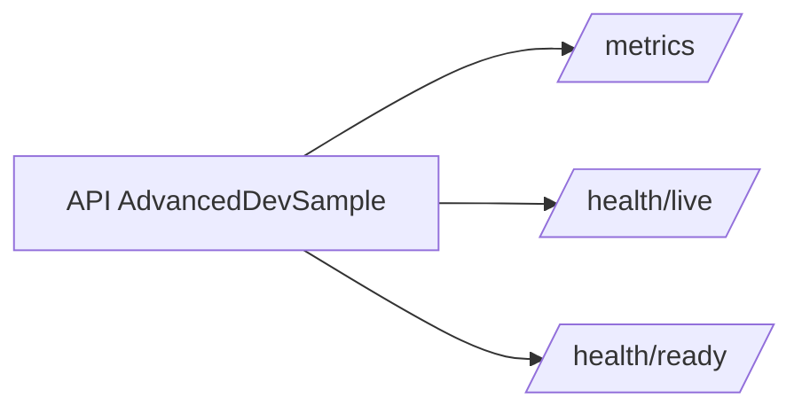
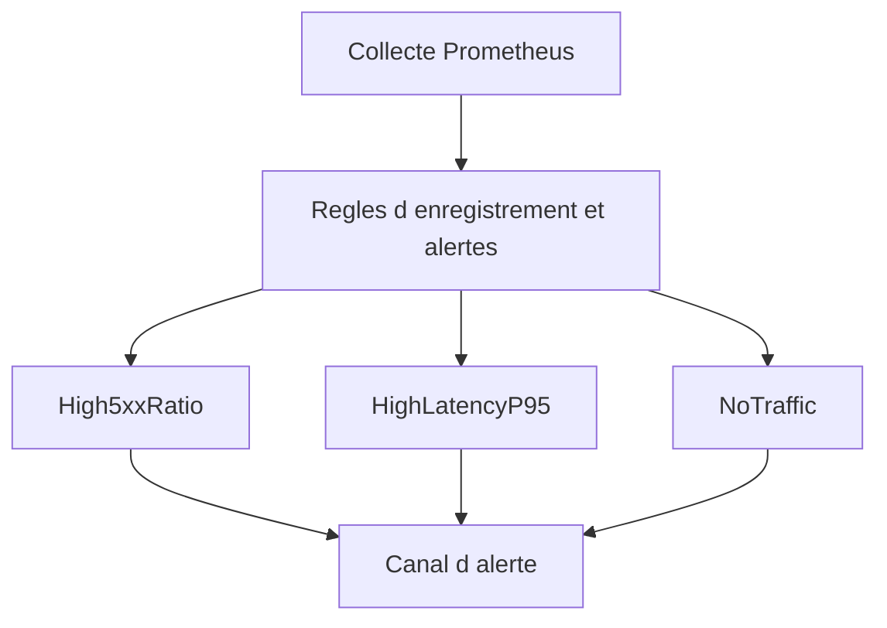
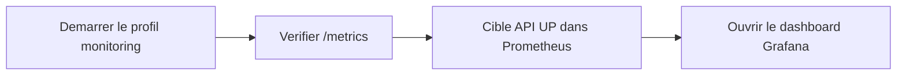

# Monitoring

## Exposition API

L API expose:

- `GET /metrics` (Prometheus via OpenTelemetry)
- `GET /health/live`
- `GET /health/ready`



## Instrumentation

OpenTelemetry configure:

- traces: ASP.NET Core + HttpClient
- metriques: ASP.NET Core + HttpClient + exporter Prometheus
- export OTLP optionnel via `OTEL_EXPORTER_OTLP_ENDPOINT` ou `OpenTelemetry:Otlp:Endpoint`

```mermaid
flowchart LR
  REQ[Requetes HTTP] --> OTel[Kit OpenTelemetry]
  OTel --> TR[Traces]
  OTel --> M[Metriques]
  TR --> OTLP[Endpoint OTLP optionnel]
  M --> PROM[/metrics pour Prometheus]
```

## Stack locale

Fichiers:

- `docker-compose.yml`
- `monitoring/prometheus/prometheus.yml`
- `monitoring/prometheus/alert.rules.yml`
- `monitoring/grafana/provisioning/**`
- `monitoring/grafana/dashboards/api-observability.json`

Lancement:

```bash
docker compose --profile monitoring up -d
```

Acces:

- Prometheus: `http://localhost:9090`
- Grafana: `http://localhost:3000` (`admin` / `admin`)

## Alertes par defaut

- `AdvancedDevSampleHigh5xxRatio`
- `AdvancedDevSampleHighLatencyP95`
- `AdvancedDevSampleNoTraffic`



## Verification rapide

1. lancer la stack monitoring
2. verifier `http://localhost:5069/metrics`
3. verifier la cible API en `UP` dans Prometheus
4. ouvrir le dashboard Grafana `AdvancedDevSample API Observability`


