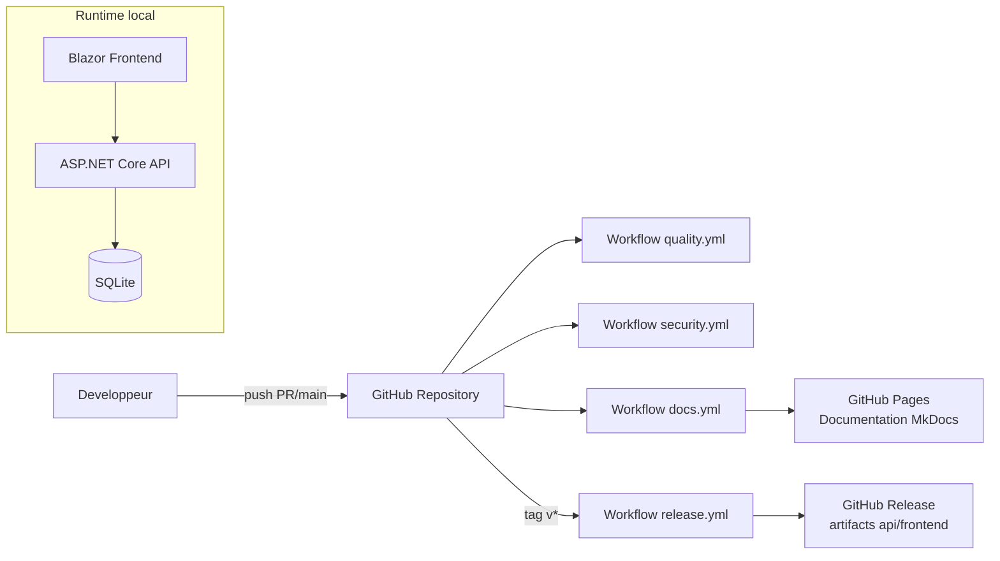

# Exploitation

## Observabilite

### Logs

- niveau global configure dans `appsettings*.json`
- middleware d'exceptions journalise selon severite:
  - warning: erreurs metier/app
  - error: infrastructure
  - critical: inattendu

### Sentry

Fonctionnalites activees:

- capture exceptions
- tracing performance
- breadcrumbs HTTP
- flush a l'arret applicatif

Conseil production:

- definir `SENTRY_DSN`
- verifier sampling (`TracesSampleRate`, `ProfilesSampleRate`)

## Demarrage applicatif

Sequence API:

1. configuration services + middlewares
2. initialisation BDD (migrations/ensurecreated)
3. seeding dev conditionnel
4. exposition controllers

## Runbook rapide

### Symptomes: API ne demarre pas

Verifier:

1. presence `JWT_SECRET` >= 32 caracteres
2. accessibilite sqlite / droits dossier
3. coherence migrations si `UseMigrations=true`

### Symptomes: frontend appelle la mauvaise API

Verifier `AdvancedDevSample.Frontend/wwwroot/appsettings.json`:

- `ApiBaseUrl`

### Symptomes: trop de `401`

Verifier:

1. token JWT non expire
2. issuer/audience alignes
3. horloge machine correcte
4. refresh token encore valide

## Publication applicative (hors docs)

Commande API:

```bash
dotnet publish AdvancedDevSample.Api/AdvancedDevSample.Api.csproj -c Release -o artifacts/api
```

Commande Frontend:

```bash
dotnet publish AdvancedDevSample.Frontend/AdvancedDevSample.Frontend.csproj -c Release -o artifacts/frontend
```

## Diagramme de deploiement


