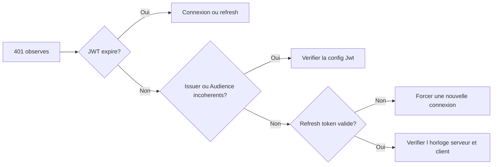
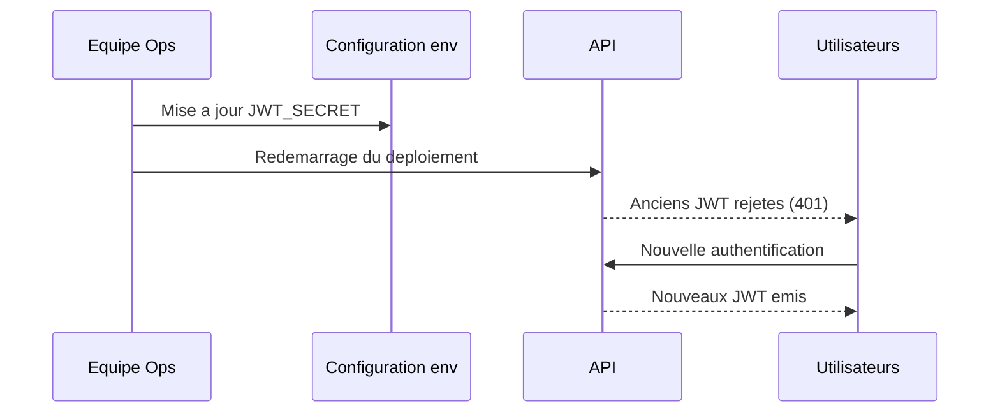

# Exploitation

## Demarrage API

Sequence:

1. configuration services et middleware
2. initialisation base (migrations/repli)
3. seeding conditionnel (`Development`)
4. exposition des routes + endpoints de sante + metriques

```mermaid
flowchart TD
  A[Demarrage API] --> B[Configuration services et middleware]
  B --> C{UseMigrations et migrations presentes?}
  C -->|Oui| D[Migrate()]
  C -->|Non| E{Environnement Development?}
  E -->|Oui| F[EnsureCreated()]
  E -->|Non| G[Echec immediat]
  D --> H{SeedDatabase et Development?}
  F --> H
  H -->|Oui| I[Execution des initialiseurs]
  H -->|Non| J[Exposition routes sante metriques]
  I --> J
```

## Observabilite

- logs ASP.NET Core
- Sentry (exceptions + tracing + breadcrumbs)
- OpenTelemetry metriques/traces
- endpoints de sante (`/health/live`, `/health/ready`)
- metriques Prometheus (`/metrics`)

## Procedures rapides

### API ne demarre pas

Verifier:

1. `JWT_SECRET` present et >= 32 caracteres
2. accessibilite PostgreSQL
3. coherence `ConnectionStrings:DefaultConnection`
4. migrations disponibles si `UseMigrations=true`

### Frontend cible la mauvaise API

Verifier:

1. `AdvancedDevSample.Frontend/wwwroot/appsettings.json` (`ApiBaseUrl`)
2. `FRONTEND_API_BASE_URL` a la construction Docker frontend

### Multiples `401`

Verifier:

1. expiration JWT
2. alignement `Jwt:Issuer`/`Jwt:Audience`
3. validite refresh token
4. horloge machine



### Multiples `429` sur login

Cause:

- limite `5/min/IP` sur `/api/auth/login`

Action:

- attendre la fenetre suivante et verifier les tentatives en boucle cote client

## Sauvegarde PostgreSQL (local)

```bash
mkdir -p backups
docker exec advanceddevsample-postgres pg_dump -U postgres advanceddevsample > "backups/advanceddevsample-$(date +%Y%m%d-%H%M%S).sql"
```

## Restauration PostgreSQL (local)

```bash
cat backups/advanceddevsample-YYYYMMDD-HHMMSS.sql | docker exec -i advanceddevsample-postgres psql -U postgres -d advanceddevsample
```

## Rotation JWT secret

Impact:

- tous les JWT existants deviennent invalides

Procedure:

1. generer un nouveau secret robuste
2. mettre a jour `JWT_SECRET`
3. redemarrer l'API
4. monitorer `401` et erreurs auth


