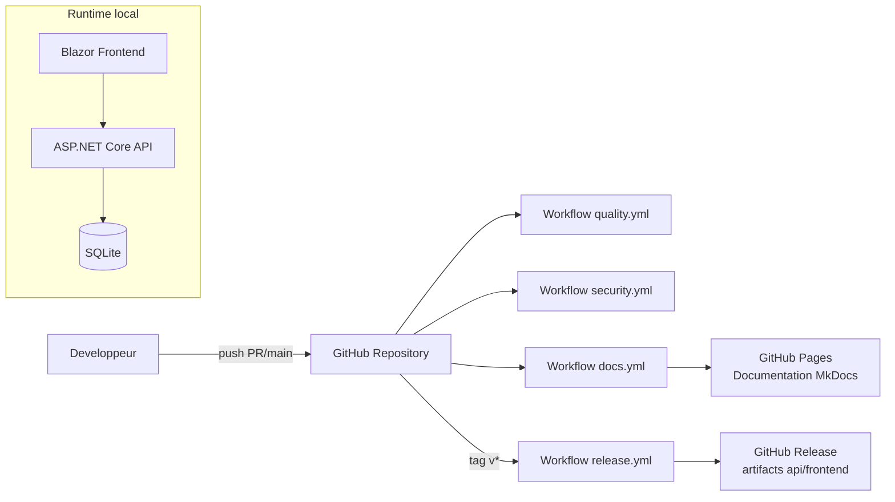

# Exploitation

## Observabilite

### Logs

- niveau global configure dans `appsettings*.json`
- middleware d'exceptions journalise selon severite:
  - warning: erreurs metier/app
  - error: infrastructure
  - critical: inattendu

### Sentry

Fonctionnalites activees:

- capture exceptions
- tracing performance
- breadcrumbs HTTP
- flush a l'arret applicatif

Conseil production:

- definir `SENTRY_DSN`
- verifier sampling (`TracesSampleRate`, `ProfilesSampleRate`)

## Demarrage applicatif

Sequence API:

1. configuration services + middlewares
2. initialisation BDD (migrations/ensurecreated)
3. seeding dev conditionnel
4. exposition controllers

## Runbook rapide

### Symptomes: API ne demarre pas

Verifier:

1. presence `JWT_SECRET` >= 32 caracteres
2. accessibilite sqlite / droits dossier
3. coherence migrations si `UseMigrations=true`

### Symptomes: frontend appelle la mauvaise API

Verifier `AdvancedDevSample.Frontend/wwwroot/appsettings.json`:

- `ApiBaseUrl`

### Symptomes: trop de `401`

Verifier:

1. token JWT non expire
2. issuer/audience alignes
3. horloge machine correcte
4. refresh token encore valide

## Runbooks production

### Rollback apres release

Preconditions:

1. identifier le tag stable precedent (`vX.Y.Z`)
2. verifier les artefacts de la release precedente (API + Frontend)
3. informer les consommateurs API d'une fenetre de rollback

Procedure:

1. redeployer les artefacts du tag stable precedent
2. redemarrer l'API
3. verifier `GET /swagger/v1/swagger.json` et un endpoint de lecture (`GET /api/products`)
4. verifier les logs d'erreurs et les evenements Sentry 5 a 10 minutes apres rollback

### Sauvegarde SQLite

Exemple local:

```bash
mkdir -p backups
cp advanceddevsample.db "backups/advanceddevsample-$(date +%Y%m%d-%H%M%S).db"
```

Bonnes pratiques:

1. faire une sauvegarde avant migration/release
2. conserver plusieurs points de restauration
3. tester periodiquement une restauration a blanc

### Restauration SQLite

Exemple local:

```bash
cp backups/advanceddevsample-YYYYMMDD-HHMMSS.db advanceddevsample.db
```

Puis:

1. redemarrer l'API
2. verifier les endpoints critiques
3. verifier les contraintes metier (auth, lecture produits, ecriture admin)

### Rotation du secret JWT

Impact:

- tous les JWT emis avant rotation deviennent invalides
- les utilisateurs doivent se reconnecter

Procedure recommandee:

1. generer un nouveau `JWT_SECRET` (>= 32 caracteres, aleatoire)
2. mettre a jour la variable d'environnement
3. redemarrer l'API dans une fenetre planifiee
4. monitorer les `401` pendant la periode de transition

## Publication applicative (hors docs)

Commande API:

```bash
dotnet publish AdvancedDevSample.Api/AdvancedDevSample.Api.csproj -c Release -o artifacts/api
```

Commande Frontend:

```bash
dotnet publish AdvancedDevSample.Frontend/AdvancedDevSample.Frontend.csproj -c Release -o artifacts/frontend
```

## Diagramme de deploiement



## Voir aussi

- [Configuration](configuration.md)
- [Securite](security.md)
- [Troubleshooting](troubleshooting.md)
